# **WriterAI** 

**WriterAI** is an AI based content writing tool that helps users easily write high quality emails, blogs, letters, thesis and other stuff. One can also share their project with others and work as a team.

This project is developed by **Team 404** for Hashnode x PlanetScale hackathon. This team comprises of [Ishant](https://github.com/ishantchauhan710/) and [Vaibhav](https://github.com/Vaibhav2002).

## About :dart:

WriterAI is a web app where a user can make use of artificial intelligence to quickly write high quality content. Just provide the AI with a sample input of one to two lines and the AI will generate 5 different paragraphs for you!

## Blog :writing_hand:
To know more about how we built this project, read my article here: <br>
[https://ishantchauhan.hashnode.dev/WriterAI-securely-store-access-and-share-your-files-on-cloud](https://ishantchauhan.hashnode.dev/WriterAI-securely-store-access-and-share-your-files-on-cloud)

## Website Demo

You can try this website by clicking on the link below 👇

[https://writerai.netlify.app/](https://writerai.netlify.app/)

## Insights Into Project 🔎
|   |   | 
|---|---|
|| 
|| 
|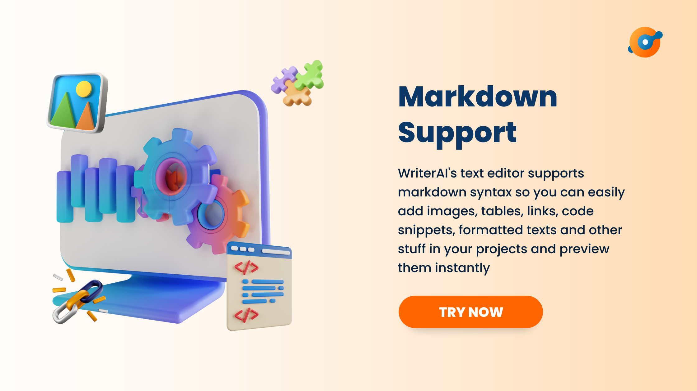| 

## WriterAI Features :fire:

- **Auto Text Completion** - Generates upto 120 words with an input of just 5 words
- **Inbuilt Text Editor** - For writing your blogs, emails, thesis, letters and other stuff
- **Project Sharing** - You can share your project with unlimited number of users and work in teams
- **Markdown Support** - You can add images, tables, hyperlinks and code snippets in your projects by using markdown
- **Project Download** - You can download your projects in JSON, XML and Markdown format
- **User Authentication** - Supports Email-Password authentication and Gmail authentication
- **User Authorization** - WriterAI keeps on validating the user's auth tokens every 5 minutes automatically

## 📸 Screenshots :computer:

|   |   |   |
|---|---|---|
|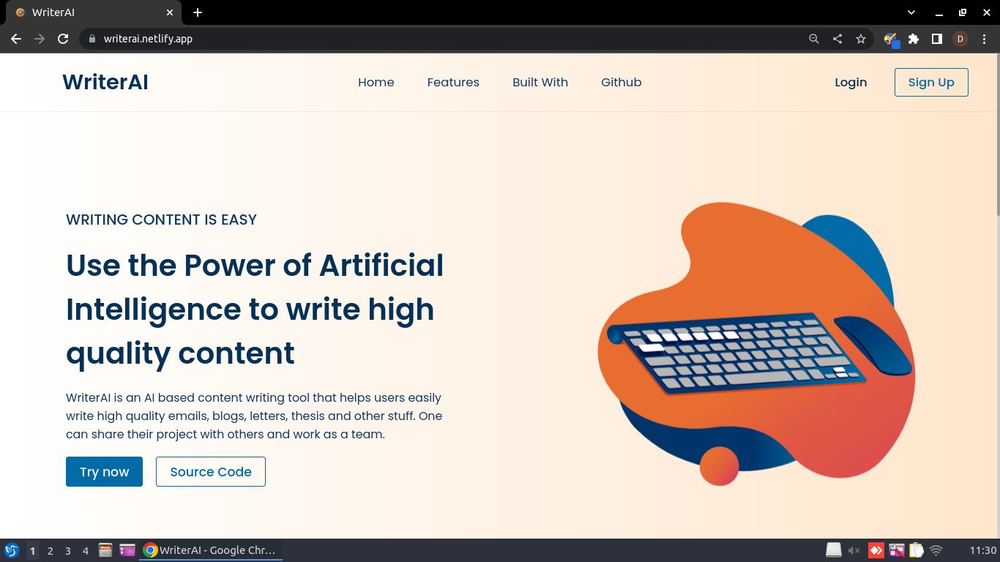| 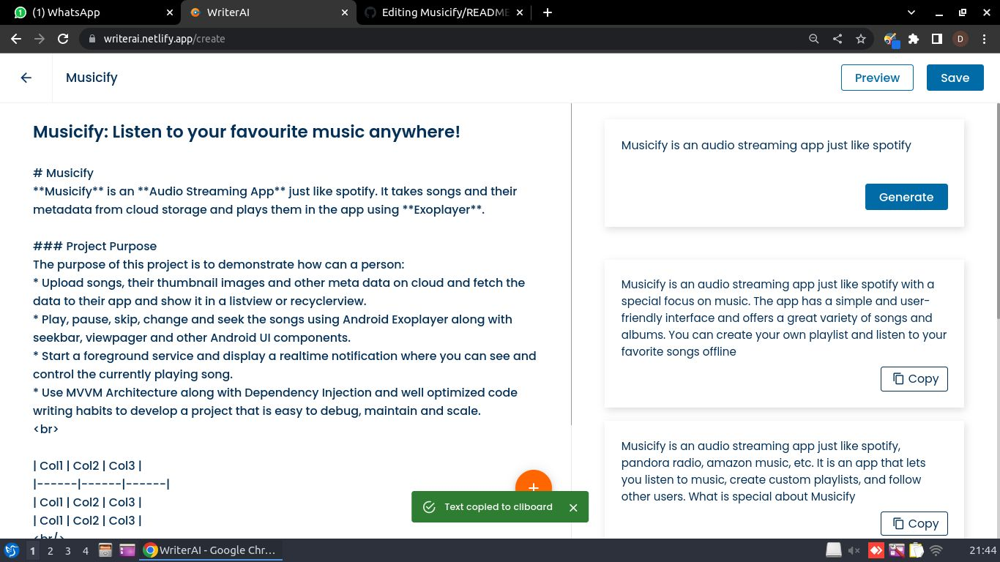 | 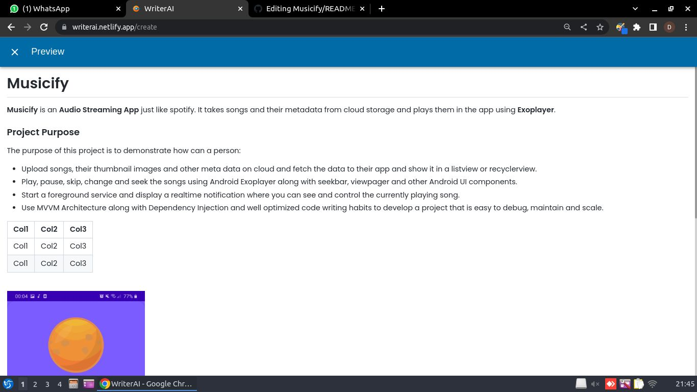
|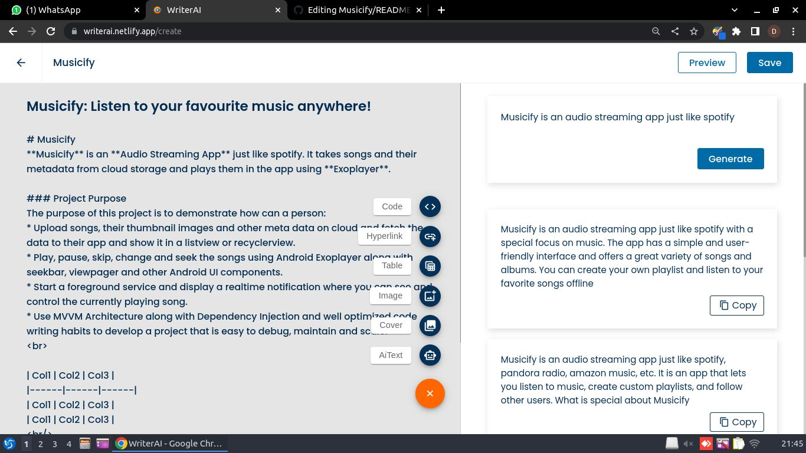 | 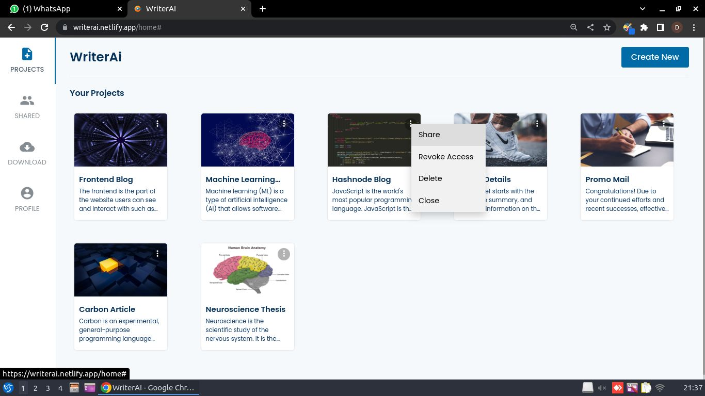 |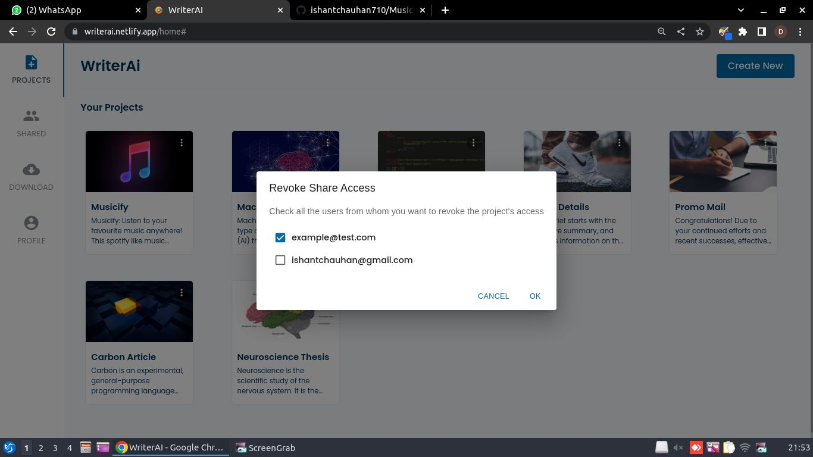 
|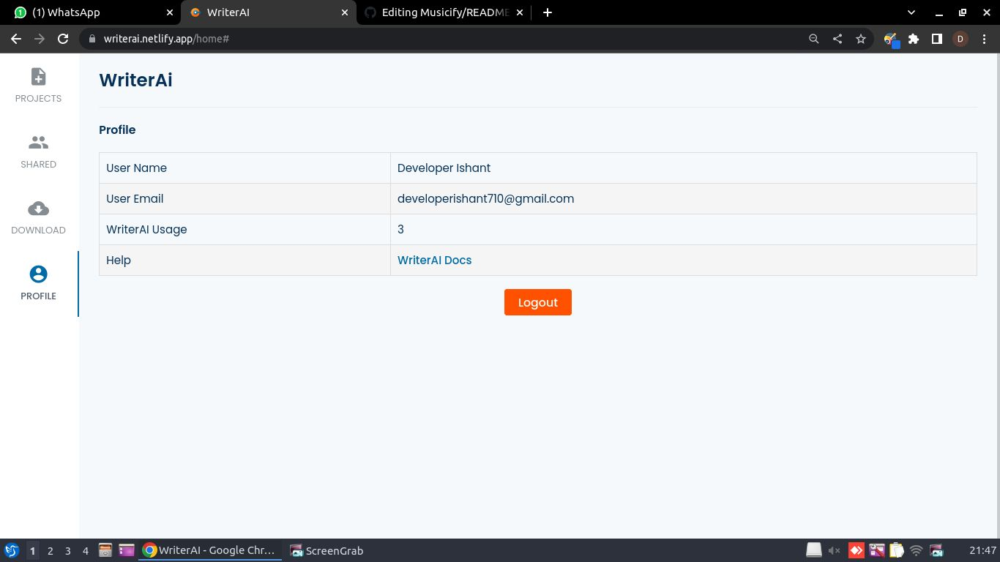|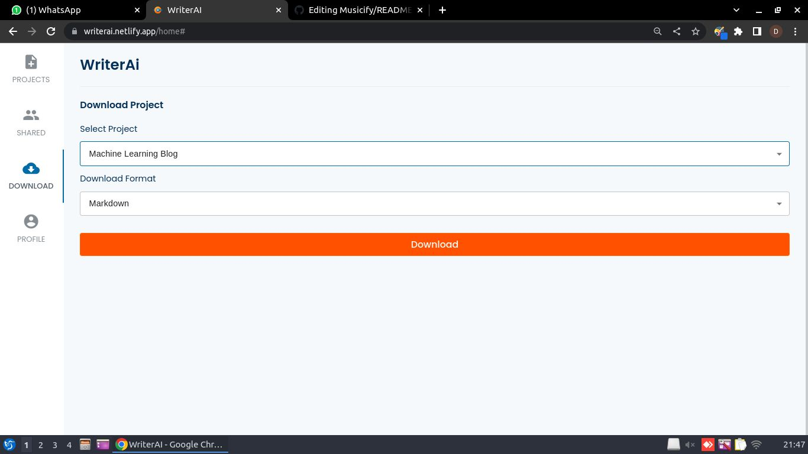 | 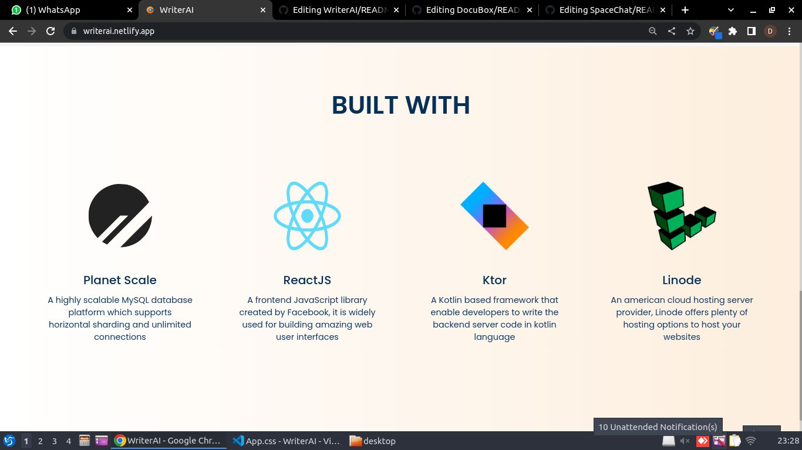

## 📸 Screenshots :iphone:

|   |   |   |
|---|---|---|
|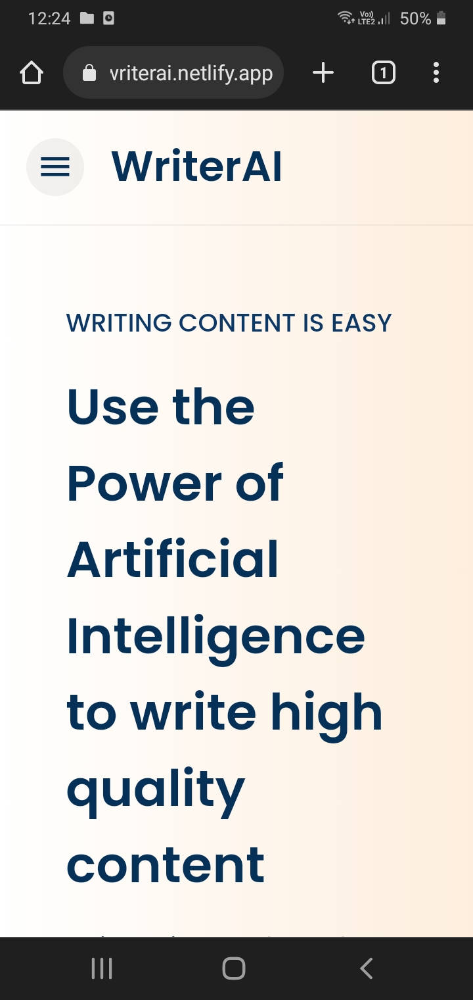| 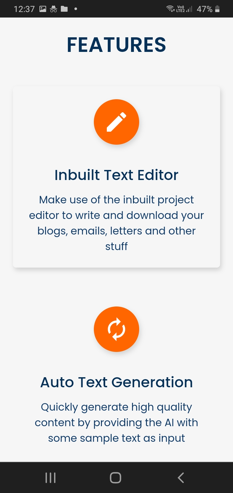 | 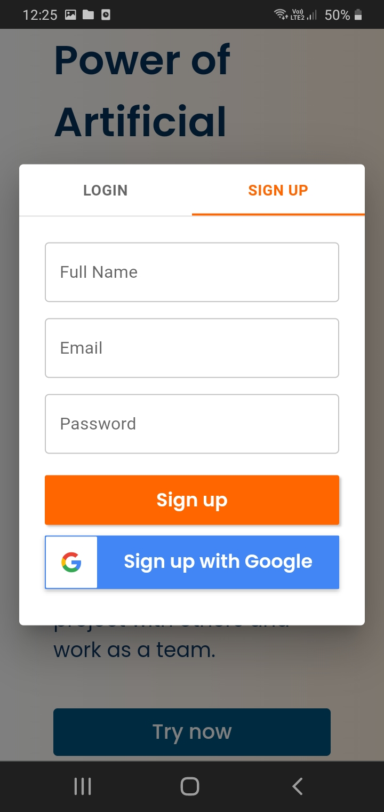
| | 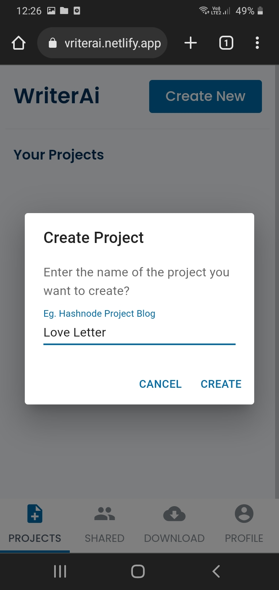 |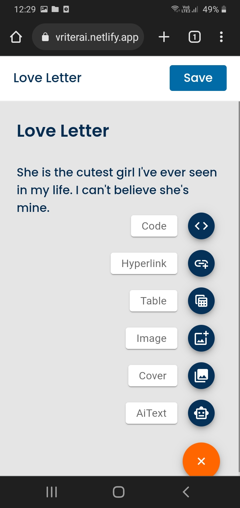 
|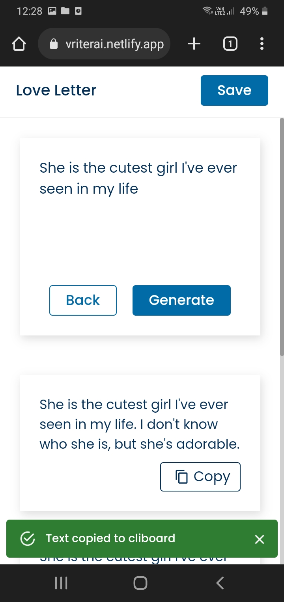|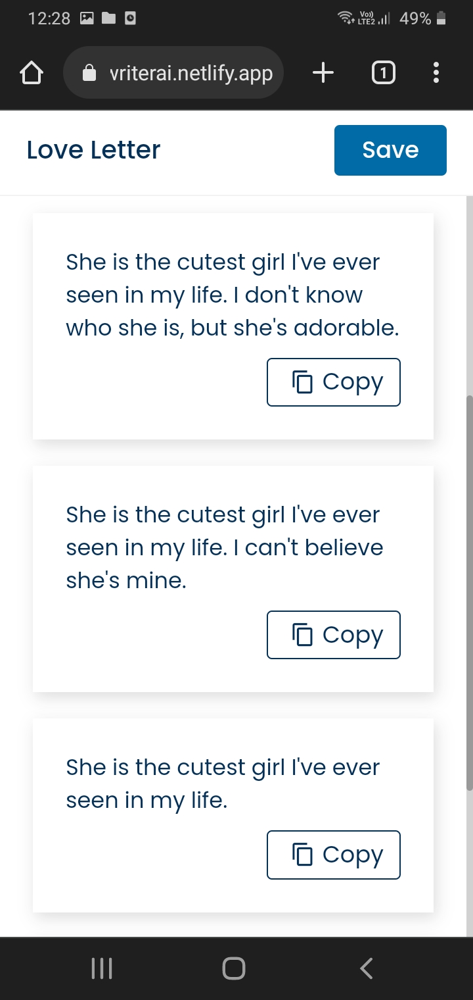 | 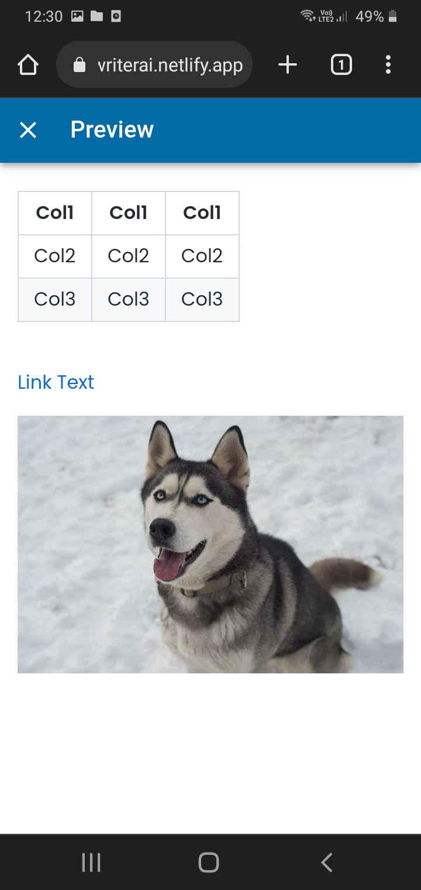
|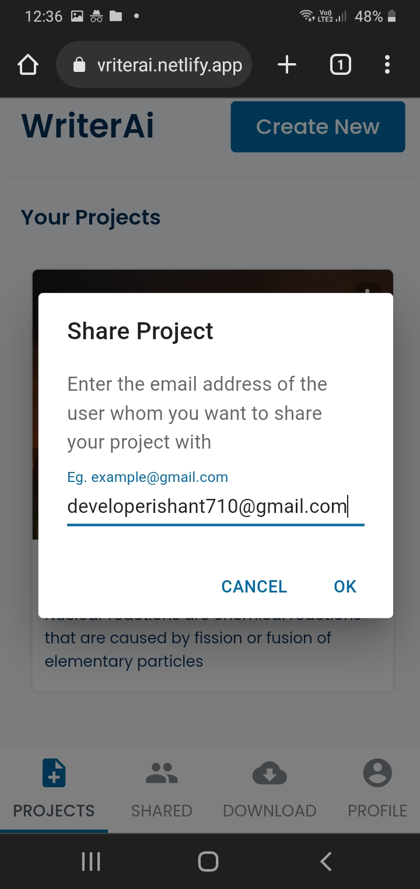| | 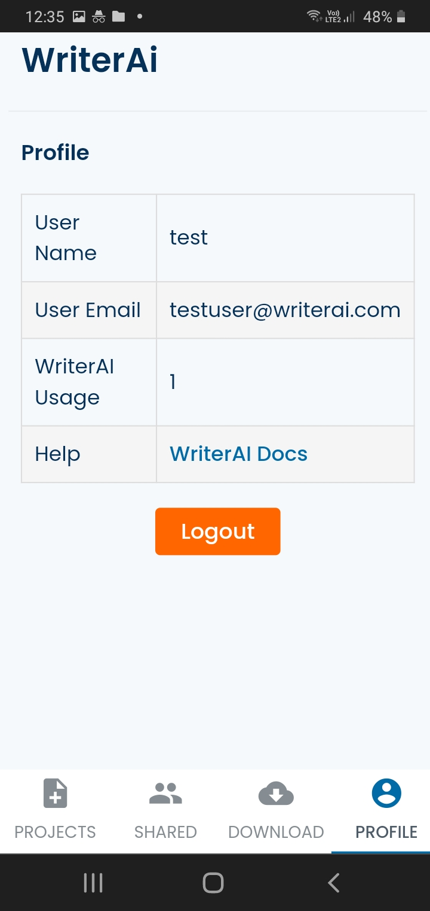


## Technical details :bulb:

- The frontend of WriterAI is created using technologies like CSS, ReactJS and MaterialUI. WriterAI is highly responsive and is tested on all popular browsers like Chrome, Safari and Opera Mini. For handling the react state\s, ContextAPI is used. The frontend code is highly structured and BEM convention is followed throughout the entire CSS code.

- The backend of WriterAI is built using Ktor which is a Kotlin based framework for writing server side code! For storing the user's data, we have used PlatenScale which is a highly scalable MySQL database platform which supports horizontal sharding and unlimited connections. For authentication, we have used Firebase SDK. And for deployment of the backend, we have used Linode.


## Setup [Frontend] :pencil:
If you want to clone this project and customize it further, you need to do a couple of tasks first:
* Clone this project. You can directly download the source code, or you can use the CLI in terminal
* Once successful, open your terminal in the project folder and write npm install
* After this, in the root folder of the project, create a new file with the exact name of ".env"
* In the .env file, write:<br><br>

```
REACT_APP_FIREBASE_API_KEY=XXXXXXXX
REACT_APP_FIREBASE_AUTH_DOMAIN=XXXXXXXX
REACT_APP_FIREBASE_PROJECT_ID=XXXXXXXX
REACT_APP_FIREBASE_STORAGE_BUCKET=XXXXXXXX
REACT_APP_FIREBASE_MESSAGING_SENDER_ID=XXXXXXXX
REACT_APP_FIREBASE_APP_ID=XXXXXXXX
REACT_APP_FIREBASE_MEASUREMENT_ID=XXXXXXXX
REACT_APP_AI_API_KEY=XXXXXXXX
REACT_APP_BASE_URL=XXXXXXXX
```


* Get the value of first 7 variables by creating a firebase account, enabling user authentication and downloading the firebase configuration json file
* Get the API key to enable AI support from OpenAI
* Get a domain and enable SSL on it in order to use it. Not doing so may result in CORS errors. See backend documentation for more.
* Save the file and then in frontend and backend terminal, write npm start and enjoy the project :)

## Built With [Frontend] 🛠

* [GPT-3 AI](https://en.wikipedia.org/wiki/GPT-3) - Generative Pre-trained Transformer 3 is an autoregressive language model that uses deep learning to produce human-like text
* [ReactJS](https://reactjs.org/docs/getting-started.html) - ReactJS is a javascript library created by Facebook. This library lets you create beautiful web pages in couple of minutes
* [MaterialUI](https://mui.com/) - MaterialUI is a ReactJS library developed by google that lets you create beautiful UI elements in a quick go!
* [React Router DOM](https://v5.reactrouter.com/web/guides/quick-start) - React Router DOM is a NPM package that easily lets you tell the app about which web page or screen component to render depending upon a particular URL
* [Lottie React](https://www.npmjs.com/package/lottie-react) - Lottie React is an npm package that lets you render Lottie JSON animations on the web page
* [Axios](https://www.npmjs.com/package/axios) - Axios is an NPM package that lets you easily send HTTP requests to a particular URL
* [JsonWebToken](https://www.npmjs.com/package/jsonwebtoken) - It is a package that lets you make use of JWT authentication in your app
* [Firebase](https://en.wikipedia.org/wiki/Firebase) - Firebase is a platform developed by Google for adding backend functionalities like authentication in projects.


## Project Structure [Frontend] :open_file_folder:

    # Root Package
    .
    ├── src                 # Our core frontend code consisting of all views and react components
    |   ├── components      # Contains UI component files for dialog boxes, notifications etc
    |   ├── other           # Contains files for constant variables and placeholder data
    |   ├── components      # Contains UI component files for dialog boxes, snackbars, single user in inbox etc
    │   ├── pages           # Contains files to represent the screen for each route like LandingPage.js for '/', HomePage.js for '/home' etc
    │   ├── res             # Contains resource files for animations
    │   ├── util            # Contains utility functions for formatting strings and dates
    │   ├── security        # Contains firebase configuration, firebase methods and other security related functions
    │   ├── style           # Contains configurations for MaterialUI setup
    │   ├── App.css         # CSS file to provide a common styling to our app such as font family and box sizing
    │   ├── index.css       # Currently of no use, however you can use it to provide a global style to your app
    │   ├── App.js          # Our main frontend ReactJS file that is executed when server starts
    │   ├── AppContext.js   # ReactJS ContextAPI file to allow all components access a particular react state easily
    │   └── index.js        # A ReactJS file to render all the data on web page
    └──

## Production Build :computer:
* To build the project for production purpose, open the frontend folder and write npm run build
* Once the build is completed, simply write npm start to run the website in production mode

## Setup [Backend] 🛠
For this, you can refer to the [Backend Repository](https://github.com/Vaibhav2002/WriterAI-Backend) of WriterAI to setup and deploy the backend

## Attribution
The project is built using [PlanetScale](https://planetscale.com/) for the [Hashnode X PlanetScale Hackathon](https://townhall.hashnode.com/planetscale-hackathon).

## Contact
For any queries, you can mail me at developerishant710@gmail.com


